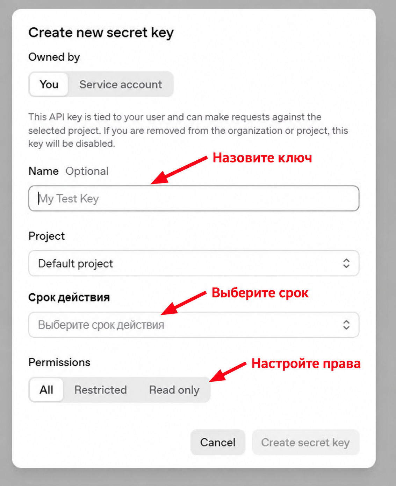
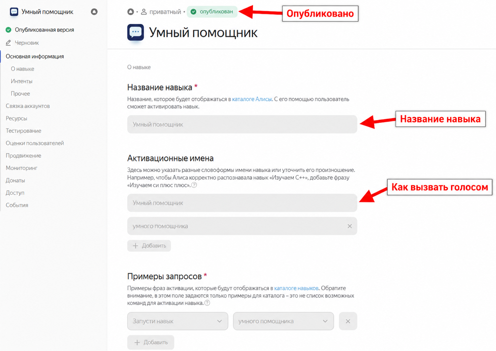
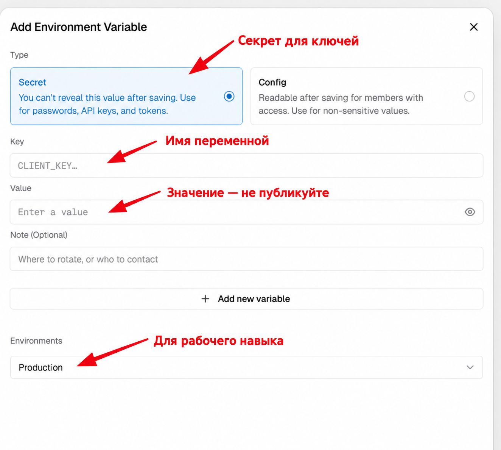

# ChatGPT в Яндекс Станции через приватный навык Алисы

Пошаговая инструкция на русском для человека без опыта программирования. Вы говорите **колонке**: «Алиса, запусти навык умный помощник», затем задаёте вопрос. Алиса передаёт текст в ваш вебхук на Vercel, тот получает ответ через OpenAI API и возвращает его колонке. На запрос «поищи в интернете…» включается веб-поиск.

> Это отдельный навык. Он запускается голосом и работает на Яндекс Станции Лайт и других устройствах с навыками Алисы. Он не заменяет Алису целиком и не перехватывает обычные команды вроде «сделай громче».

## Оглавление

- [Что получится](#что-получится)
- [Что понадобится](#что-понадобится)
- [Как это работает](#как-это-работает)
- [Почему выбран этот вариант](#почему-выбран-этот-вариант)
- [Установка за 10 шагов](#установка-за-10-шагов)
- [Настройки под себя](#настройки-под-себя)
- [Стоимость и приватность](#стоимость-и-приватность)
- [Ограничения](#ограничения)
- [Если что-то не работает](#если-что-то-не-работает)
- [Другие варианты](#другие-варианты)
- [Файлы проекта](#файлы-проекта)
- [Источники](#источники)

## Что получится

Обычный вопрос: «Алиса, запусти навык умный помощник» → «Объясни, что такое чёрная дыра». Колонка отвечает вслух. Вопрос «Поищи в интернете последние новости о космосе» включает поиск; найденные ссылки могут появиться кнопками в чате Алисы. В пределах открытого навыка можно задавать уточнения. Скажите «сброс», чтобы начать новый разговор, или «выход», чтобы завершить навык.

## Что понадобится

1. Яндекс ID, колонка с Алисой или приложение для теста, доступ к [Яндекс Диалогам](https://dialogs.yandex.ru/developer). Для создания навыка Яндекс может потребовать двухфакторную аутентификацию.
2. Учётная запись [GitHub](https://github.com/) и [Vercel](https://vercel.com/). Для простого способа не нужны локальный Python, терминал и собственный сервер.
3. Учётная запись [OpenAI Platform](https://platform.openai.com/), доступная в [поддерживаемой стране](https://developers.openai.com/api/docs/supported-countries), включённая оплата API и ключ API. **Подписка ChatGPT Plus/Pro не оплачивает API** — это отдельный продукт.
4. Примерно 20–40 минут. Названия кнопок в сервисах могут немного измениться.

Ключи и токены **не отправляйте в сообщения, Issue, скриншоты или файлы GitHub**. На картинках ниже показаны пустые формы.

## Как это работает

```text
ваш голос → Алиса → приватный навык → HTTPS-вебхук Vercel
                                          ↓
                                      OpenAI API
                                          ↓
                       текст ответа → Алиса → голос колонки
```

Вебхук — обычный адрес HTTPS, который Яндекс вызывает после вашей фразы. Код в [`api/index.py`](api/index.py) проверяет секрет в адресе и ID навыка, отправляет текст в OpenAI Responses API и формирует ответ в формате Яндекс Диалогов. Для явных просьб «найди», «поищи», «новости», «погода» он включает инструмент веб-поиска. Обычные вопросы не запускают поиск, чтобы отвечать быстрее и дешевле.

## Почему выбран этот вариант

| Решение | Причина |
| --- | --- |
| Приватный навык Яндекс Диалогов | Работает на самой колонке; запускать могут аккаунты, которым владелец дал доступ. |
| Vercel | Даёт HTTPS и развёртывание прямо из GitHub, без настройки сервера. Можно начать на Hobby для личного некоммерческого проекта. |
| Python без внешних пакетов | Меньше настроек и зависимостей при развёртывании. |
| OpenAI Responses API | Даёт ответы модели, контекст беседы и веб-поиск в одном API. |
| Короткий ответ и поиск только по запросу | У Яндекса короткий срок ожидания ответа вебхука; длинный поиск иногда потребует дополнительной фразы «что нашлось?». |
| Отдельный токен вебхука и проверка ID навыка | Публичный URL нельзя сделать неизвестным навсегда. Две проверки снижают риск чужих запросов. |

## Установка за 10 шагов

### 1. Сделайте свою копию кода на GitHub

Нажмите **Fork** вверху этого репозитория, затем **Create fork**. Получится ваш репозиторий. Ничего в коде менять пока не нужно. Если Vercel предложит подключить GitHub, разрешите ему доступ к **вашему форку**.

### 2. Создайте ключ OpenAI API

На [странице API keys](https://platform.openai.com/api-keys) нажмите **Create new secret key**. Дайте ключу понятное имя, выберите проект и срок действия. Для самого простого запуска оставьте **All**; при желании ограничьте права ключа до нужных операций Responses API. После создания скопируйте значение **один раз** в безопасное место. Не вставляйте его в GitHub. При ошибке `401` проверьте ключ и доступ проекта к API. Проверьте [биллинг API](https://platform.openai.com/settings/organization/billing/overview) и задайте комфортный бюджет/уведомления в настройках платформы.



### 3. Создайте приватный навык в Яндекс Диалогах

Откройте [консоль Яндекс Диалогов](https://dialogs.yandex.ru/developer) → **Создать диалог** → **Навык в Алисе**. Выберите **приватный** тип доступа. Придумайте название из двух или более слов, например «Умный помощник для дома», и удобное активационное имя. Заполните описание, примеры фраз и остальные обязательные поля. Для иконки можно загрузить [нейтральный пример 224×224](docs/images/icon-example.png) или свою квадратную картинку. Сохраните черновик.

Поля названия и активации показаны ниже на примере. **Ваше имя навыка может быть любым допустимым Яндексом**. Чтобы начать разговор, обычно говорят «Алиса, запусти навык …», а не только имя навыка.



### 4. Скопируйте ID навыка

В настройках навыка найдите **ID навыка** или UUID в адресе страницы: после `/skills/` идёт длинный идентификатор вида `xxxxxxxx-xxxx-xxxx-xxxx-xxxxxxxxxxxx`. Сохраните **только свой** ID. В шаге 7 он станет значением `ALICE_SKILL_ID`. Этот ID не является секретом, но в публичных примерах лучше использовать заглушку.

### 5. Придумайте секрет вебхука

Создайте случайную строку длиной хотя бы 32 символа и сохраните в менеджере паролей. Можно воспользоваться генератором паролей менеджера; не используйте собственное имя или простой пароль. **Не вставляйте токен в код или GitHub**. Он понадобится дважды: в Vercel и в URL вебхука Яндекса. Если адрес случайно раскрыт, замените токен и URL.

### 6. Импортируйте форк в Vercel

В [Vercel Dashboard](https://vercel.com/dashboard) нажмите **Add New → Project**, выберите свой форк и **Import**. Укажите корень проекта `/` (корень репозитория). Framework Preset можно оставить **Other**. Нажмите **Deploy**. Конфигурация [`vercel.json`](vercel.json) задаёт регион `fra1` (Франкфурт). Регион сервера должен соответствовать [правилам доступности OpenAI API](https://developers.openai.com/api/docs/supported-countries); также проверьте доступность API для вашей учётной записи. Если Vercel не предложит импорт, подключите GitHub в настройках Vercel.

### 7. Добавьте четыре переменные в Vercel

Откройте **Project → Settings → Environment Variables → Add Environment Variable**. Для рабочего навыка выберите **Production**. Добавляйте переменные **по одной** и сохраняйте. Для секретных значений выбирайте тип **Secret**, если интерфейс это предлагает.

| Key | Value | Тип |
| --- | --- | --- |
| `OPENAI_API_KEY` | ключ из шага 2 | Secret |
| `ALICE_WEBHOOK_TOKEN` | случайная строка из шага 5 | Secret |
| `ALICE_SKILL_ID` | ID из шага 4 | Config или Secret |
| `OPENAI_MODEL` | `gpt-6-luna` | Config, необязательно — это значение по умолчанию |

Не вводите кавычки вокруг значений и не добавляйте пробелы в начале/конце. **После добавления переменных сделайте Redeploy**: новые переменные применяются к следующему развёртыванию. В Vercel это **Deployments → ⋯ у последнего развёртывания → Redeploy**. Если меню отличается, создайте новый деплой через пустое изменение README в форке.



### 8. Найдите адрес вебхука

В Vercel откройте свой проект и скопируйте основной домен, например `https://МОЙ-ПРОЕКТ.vercel.app`. В Яндекс Диалогах в поле **Backend → Webhook URL** вставьте:

```text
https://МОЙ-ПРОЕКТ.vercel.app/api?token=ВАШ_СЕКРЕТ_ИЗ_ШАГА_5
```

`МОЙ-ПРОЕКТ` и `ВАШ_СЕКРЕТ_ИЗ_ШАГА_5` здесь — **заглушки**, замените их. Убедитесь, что URL начинается с `https://`, путь именно `/api`, токен после `?token=` совпадает с переменной `ALICE_WEBHOOK_TOKEN`. **Не публикуйте получившийся полный URL**: токен находится прямо в нём. В браузере GET по этому адресу возвращает `405` — это ожидаемо, потому что Яндекс отправляет POST.

### 9. Проверьте и опубликуйте приватный навык

В Яндекс Диалогах используйте вкладку **Тестирование**: напишите «Привет, кто ты?» и затем «Поищи в интернете, что нового в космонавтике». Если Яндекс показывает ошибки заполнения карточки, заполните отмеченные обязательные поля. Затем нажмите **Опубликовать**. Приватный навык после публикации остаётся приватным: им пользуются владелец и те, кому он отдельно предоставил доступ. Не передавайте ссылку приглашения без необходимости.

### 10. Скажите фразу колонке

Скажите: **«Алиса, запусти навык [ваше активационное имя]»**. Дождитесь приветствия и задайте вопрос. Если поиск занял больше времени, навык попросит сказать «что нашлось?». Для обычного долгого ответа — «готово». «Выход» закрывает навык. После выхода встроенные функции Алисы снова доступны как обычно.

## Настройки под себя

| Что поменять | Где | На что влияет |
| --- | --- | --- |
| Название и фразы запуска | Яндекс Диалоги → Основная информация | Как запускать навык голосом. |
| Иконка, описание, примеры запросов | Яндекс Диалоги | Как навык выглядит в карточке. |
| Стиль и длина ответа | `INSTRUCTIONS`, `SEARCH_PROMPT`, `MAX_ANSWER_CHARS` в [`api/index.py`](api/index.py) | Что произносит колонка. Не превышайте лимит ответа Алисы. |
| Триггеры веб-поиска | `_needs_web_search` в [`api/index.py`](api/index.py) | Когда оплачивается поиск и когда ответ ждётся дольше. |
| Модель | `OPENAI_MODEL` в Vercel | Цена, скорость и возможности; модель должна поддерживать `Responses API`, `reasoning.effort=none` и веб-поиск. |
| Доступ | Яндекс Диалоги → Доступ | Кому разрешено запускать приватный навык. |

После изменения кода в GitHub Vercel создаёт новый деплой. После изменения карточки навыка сохраните её и выполните шаги публикации, которые предложит Яндекс.

## Стоимость и приватность

- **OpenAI API оплачивается отдельно** от подписки ChatGPT. Стоимость зависит от числа запросов, токенов модели и вызовов веб-поиска; сверяйтесь с [актуальными ценами](https://developers.openai.com/api/docs/pricing) и [использованием API](https://platform.openai.com/usage).
- **Vercel Hobby** подходит для личного некоммерческого эксперимента в пределах [текущих лимитов](https://vercel.com/docs/plans/hobby). При большом трафике или коммерческом использовании изучите планы Vercel и условия сервиса.
- Текст голосового запроса проходит через Яндекс и Vercel в OpenAI. Код передаёт `store: true`, чтобы продолжать беседу по `previous_response_id`. [Документация OpenAI](https://developers.openai.com/api/docs/guides/conversation-state) описывает срок хранения ответов по умолчанию. Не произносите через навык секреты и чувствительные сведения.
- GitHub-форк может быть публичным: **в репозитории должны быть только код и пустые примеры**. Секреты хранятся в Vercel, а полный URL вебхука — в настройках Яндекс Диалогов. Логи Vercel могут содержать метаданные запросов; приложение намеренно не записывает URL с токеном и текст запросов в свой лог.

## Ограничения

- Навык **не может стать помощником по умолчанию** вместо Алисы на колонке. Его нужно запустить фразой активации. Во время открытого навыка вопросы идут в навык.
- Системные будильники, таймеры и напоминания Алисы из такого навыка не создаются. Скажите «выход», затем попросите Алису напрямую. Собственные напоминания через отдельную базу и сервис уведомлений возможны, но в этом репозитории не реализованы.
- Яндекс ждёт ответ вебхука недолго. Быстрые ответы произносятся сразу; поиск или долгий ответ иногда требуют «что нашлось?»/«готово».
- Контекст хранится в рамках сессии навыка. После выхода или команды «сброс» он обнуляется. Долговременная память не реализована.
- Источники поиска показываются кнопками там, где клиент Алисы это поддерживает. Голосом произносится краткий ответ, а не URL.

## Если что-то не работает

| Симптом | Проверьте |
| --- | --- |
| Алиса не запускает навык | Навык опубликован, доступен вашему Яндекс ID, фраза содержит «запусти навык» и правильное активационное имя. |
| Яндекс пишет об ошибке вебхука | Верный домен Vercel, `/api?token=...`, успешный Production Deployment, переменные и Redeploy. |
| Ответ «ключ не настроен» | `OPENAI_API_KEY` в Production и новый деплой после его добавления. |
| Ошибка `401` / «ключ не принят» | Ключ скопирован полностью, активен, принадлежит нужному проекту OpenAI; деньги API настроены отдельно. |
| Ошибка `403` от вебхука | Значение `ALICE_SKILL_ID` не совпадает с ID навыка, который прислал Яндекс. |
| Ошибка `404` от вебхука | Токен URL не совпадает с `ALICE_WEBHOOK_TOKEN` или переменная не задана. |
| Поиск просит «что нашлось?» | Это ожидание фонового ответа. Через несколько секунд скажите эту фразу ещё раз. |
| OpenAI недоступен из региона сервера | Проверьте текущие [поддерживаемые регионы](https://developers.openai.com/api/docs/supported-countries) и регион развёртывания; соблюдайте правила OpenAI. |

Для диагностики откройте **Vercel → Deployments → нужный деплой → Logs** и **Яндекс Диалоги → Тестирование**. Перед публикацией снимка ошибки скройте токены, URL вебхука и данные аккаунта.

## Другие варианты

| Вариант | Когда полезен | Сложность |
| --- | --- | --- |
| **Vercel + GitHub** (этот гайд) | Быстрый запуск без сервера и терминала | Низкая |
| [Свой VPS + Docker + Caddy](alternatives/docker/README.md) | Нужны контроль сервера и своя инфраструктура | Выше; нужен домен и администрирование |
| Другой HTTPS-хостинг Python | Уже есть подходящая инфраструктура | Зависит от платформы; требуется адаптер вебхука |

Хостинг и учётная запись OpenAI должны соответствовать правилам доступности API. При смене хостинга сохраняйте те же четыре переменные и защищайте вебхук.

## Файлы проекта

```text
api/index.py                  рабочий вебхук для Vercel
vercel.json                   регион развёртывания
docs/images/                 скриншоты с подсказками и нейтральная иконка
alternatives/docker/         пример для собственного VPS
tests/                       локальные проверки формата и защиты
.env.example                 названия переменных без секретов
```

## Источники

- [Яндекс: создать навык](https://yandex.ru/dev/dialogs/alice/doc/ru/skill-create-console), [поля публикации](https://yandex.ru/dev/dialogs/alice/doc/ru/publish-settings), [голосовая активация](https://www.yandex.ru/dev/dialogs/alice/doc/ru/activation), [приватный доступ](https://yandex.ru/dev/dialogs/alice/doc/ru/access).
- [OpenAI: модель](https://developers.openai.com/api/docs/models/gpt-6-luna), [веб-поиск](https://developers.openai.com/api/docs/guides/tools-web-search), [контекст беседы](https://developers.openai.com/api/docs/guides/conversation-state), [цены](https://developers.openai.com/api/docs/pricing).
- [Vercel: импорт из Git](https://vercel.com/docs/git), [переменные окружения](https://vercel.com/docs/environment-variables), [Hobby](https://vercel.com/docs/plans/hobby).

---

Это открытый пример. Перед использованием проверьте правила и цены сервисов: интерфейсы и тарифы меняются.

